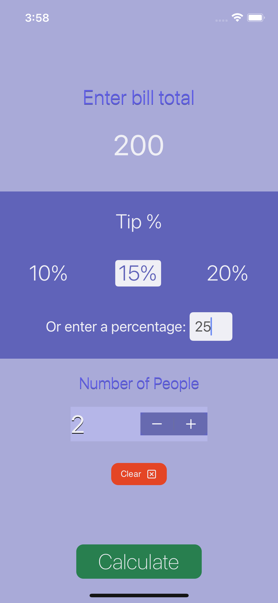
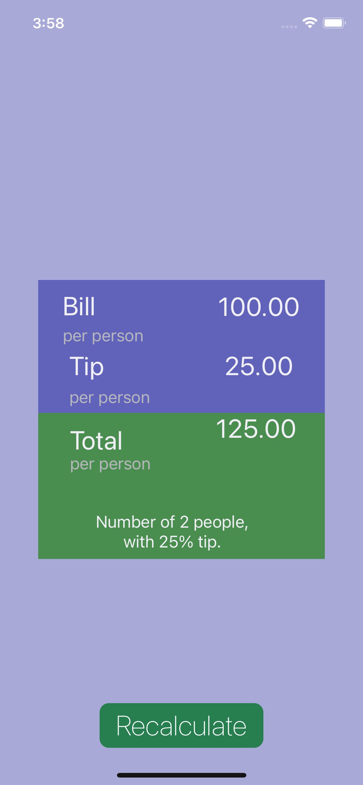

## iOS Tip Calculator App :iphone:  
This application is a tip calculator for iOS devices. It allows a user to calculate the tip with the desired tip percentage and number of people which the bill will be split. This app was created to get experience auto layering, and using UIButton, UIStoryboardSegue, UIStepper, and UITapGestureRecognizer.

<p><b>Tools:</b> Xcode</p>
<p><b>Languages:</b> Swift</p>


#### Screenshots





### How to use
1. Download source code
2. Unzip the downloaded folder
3. Open project in Xcode and play

**Using Terminal:**
```
  git clone https://github.com/acatarinaoaraujo/tip-calculator.git
  ```
 ### Contact
 <em> In case you want to contribute to this app, send me an email at acoa_@hotmail.com.</em> :bulb:
